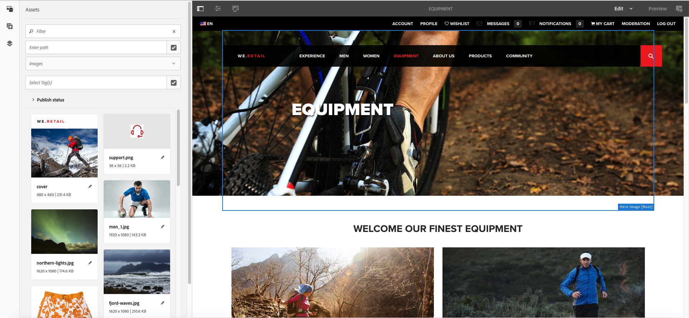

# TL14 - Enhance content creation and diffusion with Adobe Sensei and Adobe Target

## Agenda
[Chapter 01 - Boostrap](#chapter-01---bootstrap)  
[Chapter 02 - Concepts](#chapter-02---concepts)  

## Chapter 01 - Bootstrap

### AEM Start
Start AEM by executing the following steps

1. Open a **Terminal** window and navigate to path */Users/tl14/Desktop/aem-6.5-summit-london*

:computer: `cd /Users/tl14/Desktop/aem-6.5-summit-london`

2. Execute the following command

:computer: `java -Xmx6G -jar cq-quickstart-6.5.0.jar -r author,dynamicmedia_scene7  -nobrowser -nofork`

3. Using Chrome, log in to [AEM Author](http://localhost:4502)
* User name: admin
* Password: admin

### Package Installation

1. Download [LAB14 Package](https://github.com/fornacif/summit-emea-tl14/blob/master/package/LAB14-1.0.0-SNAPSHOT.zip?raw=true)
1. Navigate to [CRX/DE](http://localhost:4502/crx/packmgr/index.jsp)
1. Upload Package
 
1. Select Package
 
1. Install Package
 
1. Start Install
 

## Chapter 02 - Concepts

During this lab we will work on the **We.Retail** reference site.
We will update the **Equipment** page and modify some existing components.
For that, we need to gather some Assets that we will use in the Hero banner and some teasers.

1. Navigate to [AEM Home Page](http://localhost:4502/aem/start.html)
2. Open the [Sites](http://localhost:4502/sites.html/content) module
 
3. Open the [Equipment](http://localhost:4502/editor.html/content/we-retail/us/en/equipment.html) page in edition mode
 
4. Observe page structure
 

:bulb: Notice that components are not editable, they inherit from the master page. Later, we will cancel inheritance of components we want to update.

:warning: Don't forget to switch from *Edit* to *Preview* mode to activate navigation links.

## Chapter 03 - Assets import
