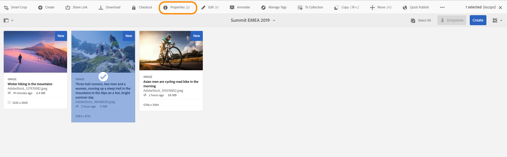
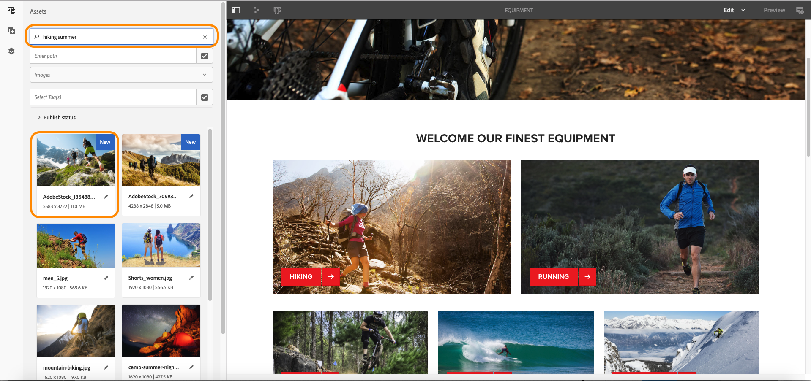

# TL14 - Enhance content creation and diffusion with Adobe Sensei and Adobe Target

## Agenda
[Chapter 01 - Boostrap](#chapter-01---bootstrap)  
[Chapter 02 - Overview](#chapter-02---overview)  
[Chapter 03 - Assets](#chapter-03---assets)  
[Chapter 04 - Stock](#chapter-04---stock)  
[Chapter 05 - Fragments](#chapter-05---fragments)  
[Chapter 06 - Personalisation](#chapter-06---personalisation)  

## Chapter 01 - Bootstrap

### AEM Start
Start AEM by executing the following steps

1. Open a **Terminal** window and navigate to path */Users/tl14/Desktop/aem-6.5*

:computer: `cd /Users/tl14/Desktop/aem-6.5-summit-london`

2. Execute the following command

:computer: `java -Xmx4G -jar cq-quickstart-6.5.0.jar -r dynamicmedia_scene7 -nofork`

3. Using Chrome, log in to [AEM Author](http://localhost:4502)
* User name: admin
* Password: admin

### Package Installation

1. Download [LAB14 Package](https://github.com/fornacif/summit-emea-tl14/blob/master/package/LAB14-1.0.0-SNAPSHOT.zip?raw=true)
1. Navigate to [CRX/DE](http://localhost:4502/crx/packmgr/index.jsp)
1. Upload Package
 
1. Select Package
 
1. Install Package
 
1. Start Install
 

## Chapter 02 - Overview

During this lab we will work on the **We.Retail** reference site.
We will update the **Equipment** page and modify some existing components.
For that, we need to gather some Assets that we will use for the Hero Banner and Teasers.

1. Navigate to [AEM Home Page](http://localhost:4502/aem/start.html)
1. Open the [Sites](http://localhost:4502/sites.html/content) module
 
1. Open the [Equipment](http://localhost:4502/editor.html/content/we-retail/us/en/equipment.html) page in edition mode
 
1. Observe page structure
 

:bulb: Note that components are not editable, they inherit from the master page. Later, we will cancel inheritance of components we want to update.

:warning: Don't forget to switch from *Edit* to *Preview* mode to activate navigation links.

## Chapter 03 - Assets

### Assets Upload

1. Navigate to [AEM Home Page](http://localhost:4502/aem/start.html)
1. Open the [Assets](http://localhost:4502/assets.html/content) module
 
1. Open the [Summit EMEA 2019](http://localhost:4502/assets.html/content) folder
 
1. Download the three following images
	* [AdobeStock_127970082.jpeg](https://raw.githubusercontent.com/fornacif/summit-emea-tl14/master/images/AdobeStock_127970082.jpeg)
	* [AdobeStock_105076852.jpeg](https://raw.githubusercontent.com/fornacif/summit-emea-tl14/master/images/AdobeStock_105076852.jpeg)
	* [AdobeStock_186488201.jpeg](https://raw.githubusercontent.com/fornacif/summit-emea-tl14/master/images/AdobeStock_186488201.jpeg)
1. Rename images by adding your initials to them
 :warning: `AdobeStock_127970082-FFO.jpeg`
1. Upload theses images through Drag & Drop
 
1. Open assets properties
 
1. Observe automatically added tags add through **Smart Tags** feature
 
1. Open **Smart Crop** editor for each assets
 
1. Observe which parts of images have been selected for both *TEASER* and *HERO* formats. 
 
 :bulb: The configuration of Smart Crop formats has been made [here](http://localhost:4502/mnt/overlay/dam/gui/content/processingprofilepage/imageprocessingprofiles/editor.html/conf/global/settings/dam/adminui-extension/imageprofile/smart-crop) and the image profile has been applied to the DAM folder.
	
### Assets Usage

1. Navigate to [AEM Home Page](http://localhost:4502/aem/start.html)
1. Open the [Sites](http://localhost:4502/sites.html/content) module
1. Open the [Equipment](http://localhost:4502/editor.html/content/we-retail/us/en/equipment.html) page in edition mode

#### Teaser Update

1. Cancel inheritance of the top left Teaser
 
1. Search for Assets by term "**hiking**"
 
1. Here we can filter images to refine results. That's where Smart Tags feature is powerful. If we want only images for summer campaign, we can search "**hiking summer**" to have more appropriate results. 
 :bulb: Keep in mind tags are coming from the file itself or enriched by Smart Tags features and thus have not been edited manually
 
1. Drag & Drop the first image (the one previously upload) to the top left Teaser
 
 :bulb: Note that the image as been cropped accordingly thanks to the **Smart Crop** feature.

#### Hero Banner Update

1. Cancel inheritance of the Hero Banner
 
1. Search for Assets by term "**biking**"
 
1. Drag & Drop the first image (the one previously upload) to the Hero Banner
 
 :bulb: Note that the image as been cropped thanks to the **Smart Crop** feature. Here the focus is made on the cyclist which is not necessary what we want
1. Open Smart Crop configuration for the cycling image and adapt it do focus on bike as we want to highlight equipments. Save changes.
 
1. Refresh the Equipments page to see results
 
1. Cancel inheritance of the bottom left Teaser
 
1. Drag & Drop the biking image to the bottom left Teaser
 
 :bulb: Note that the image as been cropped differently from the Hero Banner as it's using another format even if it's the same original image.

## Chapter 04 - Stock

Now we want to find inspiration in **Adobe Stock** catalog to find more relevant visuals.

#### Teaser Update

1. Navigate to *Assets* module root and click on **Search Adobe Stock** icon
 
1. Search for Assets by term "**biking**"
 
1. Save the already licensed image
 
 :warning: License feature as been disabled on purpose as it needs proper account with credits
1. Proceed to Next
 
1. Select *Summit EMEA 2019* folder
 
1. Go back to the *Equipment* page, search last **biking** images and Drag & Drop it to the biking Teaser
 
1. Do the same steps for replacing the *RUNNING* Teaser by an image coming from Adobe Stock
 
1. Then
 
1. Then
 

## Chapter 05 - Fragments

Now we want to create variations of the previously modified content. To do so we will leverage Experience Fragment.

### Experience Fragment Creation

1. Navigate to the [Equipment](http://localhost:4502/editor.html/content/we-retail/us/en/equipment.html) page
1. Convert Teaser to **Experience Fragment Variation**
 
1. Set properties for the Experience Fragment to *Summit EMEA 2019*. Choose an appropriate name that contains your initials like:
`Hiking XP Master - FFO`
 
1. Select destination for the Experience Fragment to *Summit EMEA 2019*
 
1. Select template for the Experience Fragment
 
1. Once the Teaser has been converted to Experience Fragment, edit it
 
1. Create two variation as live copy
 
1. Name must contain the variation name and your initials
 
1. Cancel inheritance for new Experience Fragments and replace images by ones coming from Adobe Stock. You can use the search by similarity. Be creative :blush:
 
1. Preview newly created Experience Fragments
 

### Experience Fragment Export to Target

1. Navigate the [Experience Fragements](http://localhost:4502/aem/experience-fragments.html/content/experience-fragments) module
 
1. Switch view to *List View* mode
1. Select all Experience Fragments and export them to Target
 
1. As you don't have a Publish instance, just click *Export without Publishing*
 

## Chapter 06 - Personalisation

Now we created personalised content, we can build A/B Testing, Automated Personalisation or Experience Targeting activities in Adobe Target.

The following steps will be showed during the lab and we will integrate your previously created Experience Fragments to see the result on the shared AEM Publish instance.

1. A/B Testing activity creation
 
1. Publish instance URL selection
 
1. Replacement of Experience B by Experience Fragment exported from AEM
 
1. Selection of the corresponding Target Offer
 
1. Experience B Preview
 
1. Experience C Preview
 
1. A/B Testing activity overview
 