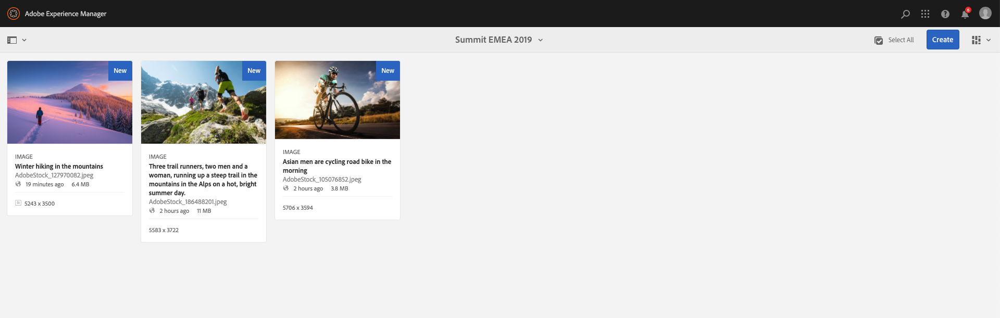

# TL14 - Enhance content creation and diffusion with Adobe Sensei and Adobe Target

## Agenda
[Chapter 01 - Boostrap](#chapter-01---bootstrap)  
[Chapter 02 - Overview](#chapter-02---overview)  
[Chapter 03 - Assets](#chapter-03---assets)  

## Chapter 01 - Bootstrap

### AEM Start
Start AEM by executing the following steps

1. Open a **Terminal** window and navigate to path */Users/tl14/Desktop/aem-6.5-summit-london*

:computer: `cd /Users/tl14/Desktop/aem-6.5-summit-london`

2. Execute the following command

:computer: `java -Xmx6G -jar cq-quickstart-6.5.0.jar -r author,dynamicmedia_scene7  -nobrowser -nofork`

3. Using Chrome, log in to [AEM Author](http://localhost:4502)
* User name: admin
* Password: admin

### Package Installation

1. Download [LAB14 Package](https://github.com/fornacif/summit-emea-tl14/blob/master/package/LAB14-1.0.0-SNAPSHOT.zip?raw=true)
1. Navigate to [CRX/DE](http://localhost:4502/crx/packmgr/index.jsp)
1. Upload Package
 
1. Select Package
 
1. Install Package
 
1. Start Install
 

## Chapter 02 - Overview

During this lab we will work on the **We.Retail** reference site.
We will update the **Equipment** page and modify some existing components.
For that, we need to gather some Assets that we will use for the Hero Banner and Teasers.

1. Navigate to [AEM Home Page](http://localhost:4502/aem/start.html)
1. Open the [Sites](http://localhost:4502/sites.html/content) module
 
1. Open the [Equipment](http://localhost:4502/editor.html/content/we-retail/us/en/equipment.html) page in edition mode
 
1. Observe page structure
 

:bulb: Note that components are not editable, they inherit from the master page. Later, we will cancel inheritance of components we want to update.

:warning: Don't forget to switch from *Edit* to *Preview* mode to activate navigation links.

## Chapter 03 - Assets

### Assets Upload

1. Navigate to [AEM Home Page](http://localhost:4502/aem/start.html)
1. Open the [Assets](http://localhost:4502/assets.html/content) module
 
1. Open the [Summit EMEA 2019](http://localhost:4502/assets.html/content) folder
 
1. Download the three following images
	* [AdobeStock_70993026.jpeg](https://raw.githubusercontent.com/fornacif/summit-emea-tl14/master/images/AdobeStock_70993026.jpeg)
	* [AdobeStock_105076852.jpeg](https://raw.githubusercontent.com/fornacif/summit-emea-tl14/master/images/AdobeStock_105076852.jpeg)
	* [AdobeStock_186488201.jpeg](https://raw.githubusercontent.com/fornacif/summit-emea-tl14/master/images/AdobeStock_186488201.jpeg)
1. Rename images by adding your initials to them
 :warning: `AdobeStock_70993026-FFO.jpeg`
1. Upload theses images through Drag & Drop
 
1. Open assets properties
 
1. Observe automatically added tags (Smart Tags)
 
1. Open *Smart Crop* editor for each assets
 
1. Observe which parts of images have been selected for both *TEASER* and *HERO* formats. 
 
	
### Assets Usage

1. Navigate to [AEM Home Page](http://localhost:4502/aem/start.html)
1. Open the [Sites](http://localhost:4502/sites.html/content) module
1. Open the [Equipment](http://localhost:4502/editor.html/content/we-retail/us/en/equipment.html) page in edition mode
1. Cancel inheritance of the top left Teaser
 
1. Search for Assets by term "**hiking**"
 
1. Here we can filter images to refine results. That's where Smart Tags are powerful. If we want only images for summer campaign, we can search "**hiking summer**" to have more appropriate results. 
:bulb: Don't forget tags are coming from the file itself or enriched by Smart Tags features and thus have not been put manually

